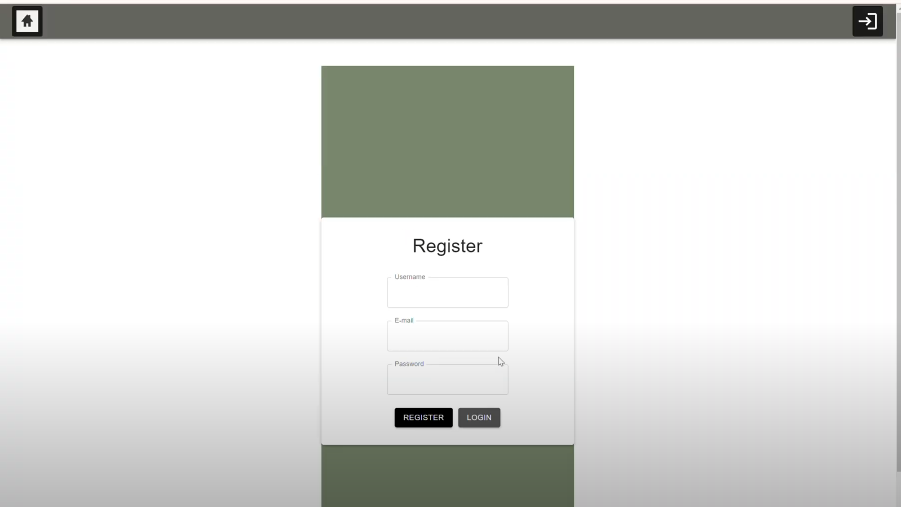

# NorthSide-E-commerce-website

This repository houses the development of a cutting-edge full-stack e-commerce application for **Northside**. As a premier shoe company in the **PNW**, NorthSide is dedicated to providing stylish, high-quality footwear to customers worldwide. This project embodies NorthSide's vision by delivering a seamless, user-friendly digital shopping experience for customers while equipping administrators with robust tools for efficient management.

Built with modern web technologies, this platform ensures high performance, scalability, and an intuitive interface tailored to meet the needs of both shoppers and the business.

---

## Features

- **User Authentication**: Secure user registration and login functionality.
- **Product Browsing**: Dynamic product listings with categories and search capabilities.
- **Shopping Cart**: Add, update, and remove items with a user-friendly interface.
- **Admin Management**: Admin dashboard to manage products, orders, and users.
- **Responsive Design**: Fully optimized for desktop and mobile devices.

---

## Technologies Used


---

## Preview

**Login**


---

## Directory Structure

```
project-folder/
├── backend                 # contents contain all files for the application backend
├── node_modules            # Dependencies
├── NorthSide               # contents contain all files for the frontend
├── orders                  # order records
└── README.md               # Project documentation
```
 
---

## Setup Instructions

1. Clone the repository:
    git clone https://github.com/username/northside-ecommerce.git
    cd northside-ecommerce

2. Install dependencies:
     For the frontend:
      cd Northside
      npm install...
   
4. Set up environment variables:
      Create a .env file in the server/ directory with the following:
        MONGO_URI=<your-mongodb-uri>
        JWT_SECRET=<your-jwt-secret>

5. Run the application:
  Start the backend:
    cd backend
    npm start
  Start the frontend:
    cd Northside
    npm start

---

## Future Enhancements
- **Payment Integration**: Add secure payment gateways (e.g., Stripe, PayPal).
- **Order Tracking**: Enable real-time order status updates.
- **Analytics Dashboard**: Provide detailed analytics for admin users.

---

## License

This project is licensed under the [MIT License](LICENSE).

---


   
